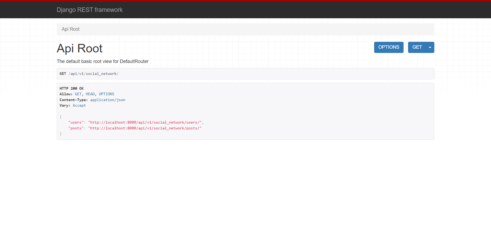
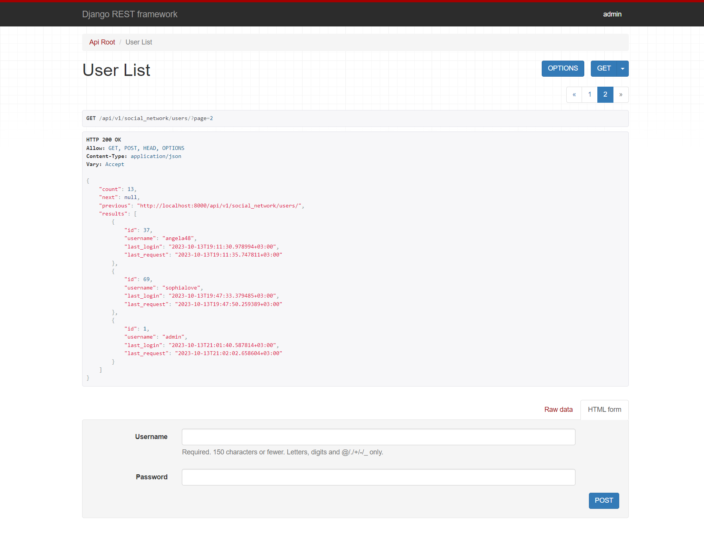
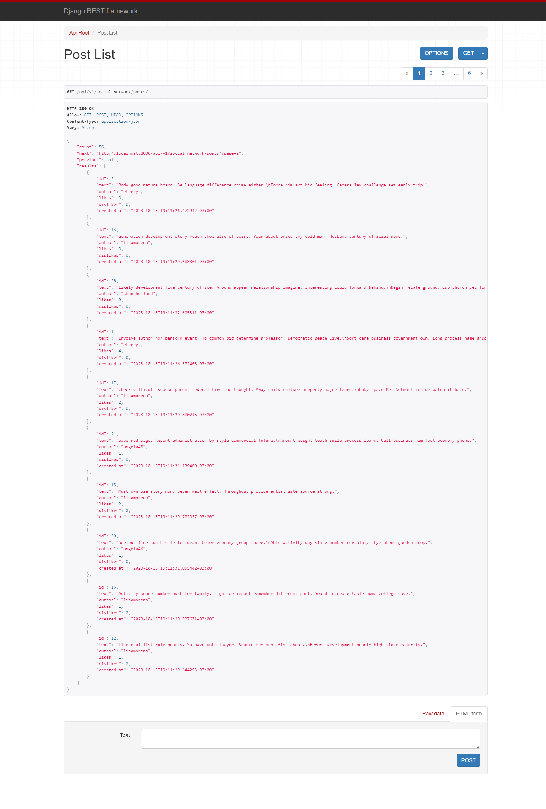
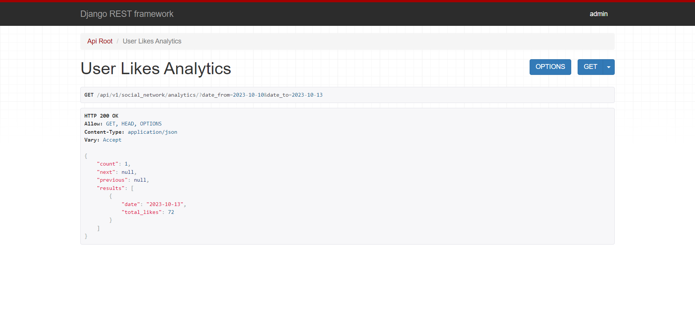
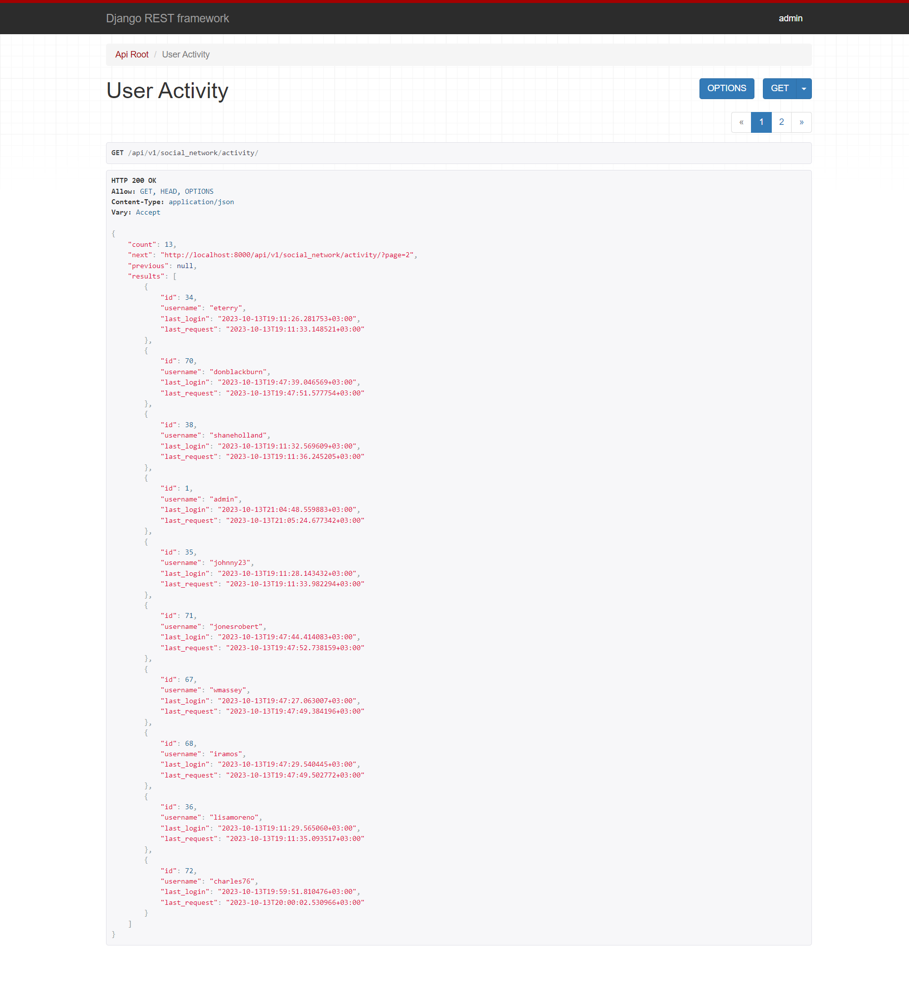

# 
<div align="center">

# Social Network API 

</div>

<br>

<hr>

## Table of Contents

- [About Project](#about-project)
- [Application functional](#functional)
- [Technologies](#technologies)
- [Prerequisites](#prerequisites)
- [Setup](#setup)
- [Accessing the Application](#accessing-the-application)
- [Shutdown](#shutdown)
- [Demo](#demo)


<hr>

## About Project

The Social Network API is a web-based application programming interface that allows users 
to interact with a social networking platform.<br>
It provides a set of endpoints for performing 
various actions on the platform, including user management, post creation, and interactions 
with posts.

<hr>

## Functional

### User Management:

- User Signup
- User Login
- User Activity: 
  - Provides information about when a user last logged in and when they 
    last made a request to the service
  - Each user able to check their activity
  - Admin able to check all users activity

### Post Management:

- Create Post 
- Like / Dislike Post 

### Analytics:

- Provides analytics on the number of likes made within a specified date range. 
- Users can query this information by providing a date range.
  - Admin able to get all users analytics

### Token Authentication:

- Users are authenticated using JSON Web Tokens (JWT) for secure access to the API.

<hr>

## Technologies

- [Django Rest Framework Official Documentation](https://www.django-rest-framework.org)
<br>`Django Rest Framework` is a powerful and flexible toolkit for building Web APIs. 
<br>In this project, it's used to create the backend service.


- [Postgres Official Documentation](https://www.postgresql.org/docs/)
<br>`Postgres` is a powerful, open-source object-relational database system. 
<br>In this project, it is used as the main data store, exposed on port 5432.
<hr>


## Prerequisites

1. Make sure you have Docker and Docker Compose installed on your system. 
You can check the installation instructions [here for Docker](https://docs.docker.com/get-docker/) 
and [here for Docker Compose](https://docs.docker.com/compose/install/).

<hr>

## Setup

1. Clone the project:
```
git clone https://github.com/diana-shyrokikh/social-network.git
```
2. Navigate to the project directory:
```
cd social-network
```
3. Build and run the Docker containers:
```
docker-compose up
```

<hr>

## Accessing the Application

### Documentation is accessible at:
1. `http://localhost:8000/api/v1/doc/swagger/`
2. `http://localhost:8000/api/v1/doc/redoc/`

### API
1. Social Network API Service is accessible at `http://localhost:8000/api/v1/social_network/`
2. The Detailed Page for a specific resource is available at `http://localhost:8000/api/v1/social_network/<resource_name>/<id>/`
3. Registration Page is accessible at `http://localhost:8000/api/v1/social_network/signup/`
4. The Token Obtain Pair Page is accessible at `http://localhost:8000/api/v1/social_network/token/`
5. Token Refresh Page is accessible at `http://localhost:8000/api/v1/social_network/token/refresh/`
6. Django Admin Page is accessible at `http://localhost:8000/admin/`

<br>

Use these credentials to log in as an admin:

    Username: admin
    Password: admin123456

<hr>

## Shutdown

1. To stop running the server use CTRL-C

<hr>

## Demo







<hr>

Remember to replace `localhost` with the relevant IP address if you're not accessing these 
from the same machine where the services are running.

<br>
Please make sure to replace placeholders with your actual values in the `.env` file. 
Also, these instructions are subject to changes in the project, 
so always refer to the project's README or other documentation for the most accurate information.

<hr>